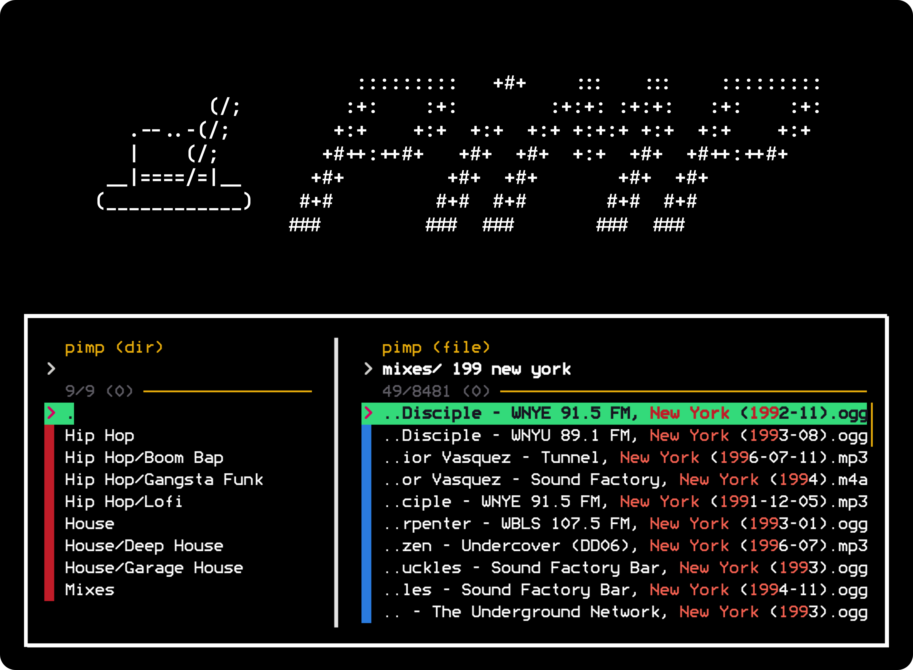

<br>
<h1 align="center">pimp</h1>

<p align="center">
	<em>A music player project for unix aficionados; designed especially to
	facilitate a screen-free, numpad-controlled playback experience for your
	vehicle's audio system.</em>
</p>

<br>

# Commands

### Default Action

Resume music playback of cached playlist file (`pimp play`) and display recursive list of subdirectories to play within default music directory or `$PIMP_DPATH_MUSIC` (`pimp dir`) once playback ends.

```shell
% pimp
```

### dir, d [-q] [query]

Display recursive list of subdirectories to play within default music directory or `$PIMP_DPATH_MUSIC`.

<table style="width: 100%; border: 0;">
	<tr>
		<td>-q</td>
		<td>Disable selection tone and text-to-speech (tts).</td>
	</tr>
</table>

```shell
% pimp d
% pimp d deep house
% pimp d -q
% pimp d -q deep house
```

### file, f [query]

Display recursive list of files to play within default music directory or `$PIMP_DPATH_MUSIC`.

```shell
% pimp f
% pimp f mixes 199 fm new york
```

### play, p, slap [-qs]

Resume music playback of cached playlist file.

<table style="width: 100%; border: 0;">
	<tr>
		<td>-q</td>
		<td>Suppress initialization tone.</td>
	</tr>
	<tr>
		<td>-s</td>
		<td>Shuffle cached playlist content.</td>
	</tr>
</table>

```shell
% pimp p
% pimp p -q
% pimp p -s
% pimp p -qs
% pimp play
% pimp slap
```


<br>
<br>
<h3 align="center">Documentation is in development!</h3>

